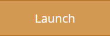
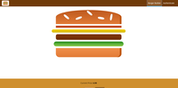
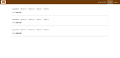
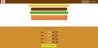

<h1 align="center">Burger Builder</h1>

<div align="center">
  <sub>Building burgers like a King!</sub>
</div>

<br/>


<div align="center">
  <a href="https://react-white-burger.firebaseapp.com/"></a>
</div>

## Description
<div align="center">
  Lorem ipsum temp short thingy
  <br/>
  <br/>
  
  
  
</div>

## Story
Lorem ipsum temp full thingy
                            
### Local Usage
```
npm install
npm start
```

## Inspiration
* [Maximilian Schwarzmüller](https://www.udemy.com/react-the-complete-guide-incl-redux/) - Dive in and learn React from scratch! Learn Reactjs, Redux, React Routing, Animations, Next.js basics and way more!

## License
This project is licensed under the MIT License


